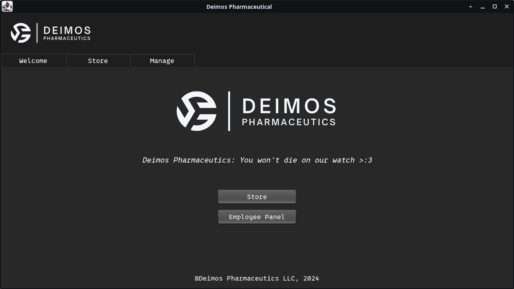
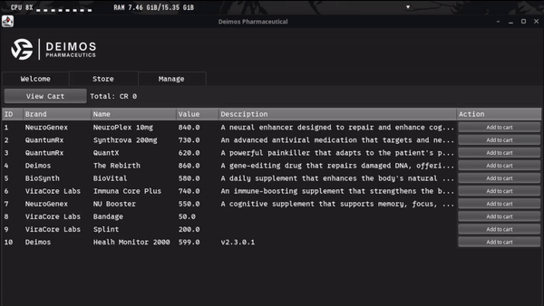
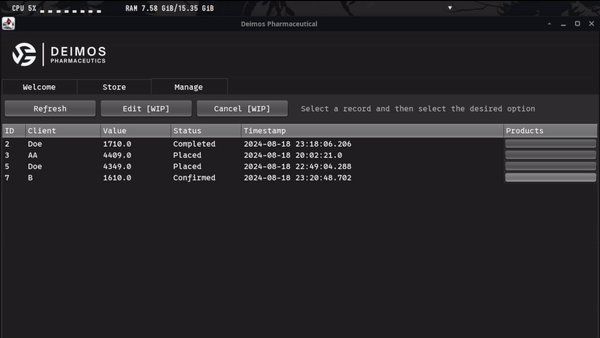
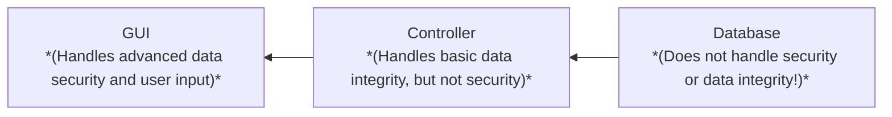

    

*Deimos Pharmaceutics - A GUI business application in Java*

[Skip to feature presentation](#presentation)

# **IMPORTNT INFO:**
- **The application is meant to simulate a website, though due to project constraints it ended up being a desktop-based mockup.**
- **The project was initially using a MariaDB (mysql) database, but was migrated to SQLite. Minor issues may occur (maybe?)**
- **Most (if not all) of the libraries used are included in the poject to minimize possible issues when using it on a diferent system.**
- **The app was tested on a XFCE based linux system, the look and feel may vary on other platforms**

## Tested on following configuration:
- jdk-openjdk 22.0.2.u9-1
- linux 6.10.5.arch1-1
- Xfce4 4.18

## Achievements & goals
### Done:
- Database model
- Database configuration
- Database manipulation from code
- SELECT, INSERT and DELETE queries through JDBC and ORMLite
- Basic GUI
- Welcome page
- Store page
- Admin panel
- Look & feel
- Migration to SQLite (should've used it in the first place)

### ~~Working on:~~

### In planning:
- Testing on edge cases
- GUI streamlining
- Fix the client bug ;-;
- Add product manipulation
- Lock/unlock admin panel

## Presentation

    
    
    
    
    

## Application structure diagram:

